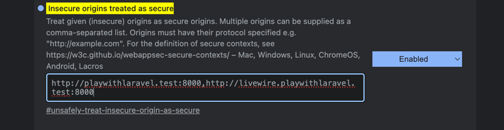

## Play With Laravel

This repo is a for a platform that allows you to play with Laravel, save the code, and share it with others, just with a link.

I'll be updating this as this goes, I'm opening it open source right away so that maybe someone else can help me out, and make this happen sooner, help shape the thing, and make it better.

## Credits

Thanks to Sean Morris for the WASM magic. Here's repo: https://github.com/seanmorris/php-wasm

## Instructions

- Clone the repo...
- ......
- ...
- Setup local domain and subdomains
- chrome://flags/#unsafely-treat-insecure-origin-as-secure
- 
