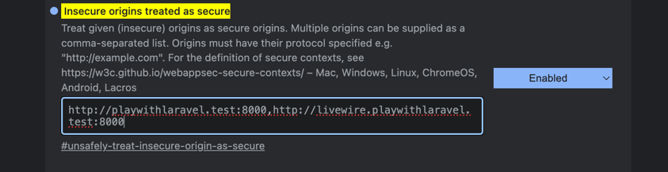
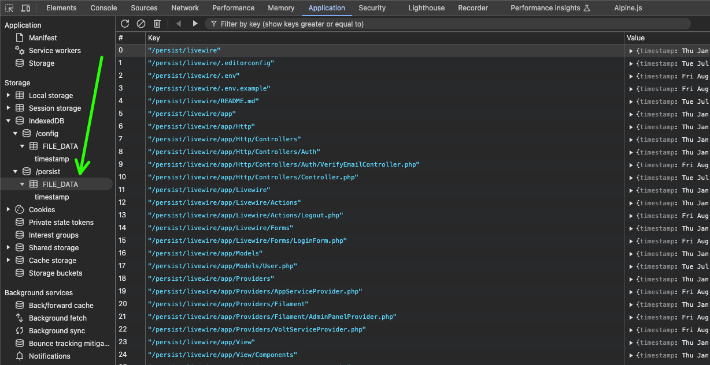

## Play With Laravel

This repo is a for a platform that allows you to play with Laravel, save the code, and share it with others, just with a link.

I'll be updating this as this goes, I'm opening it open source right away so that maybe someone else can help me out, and make this happen sooner, help shape the thing, and make it better.

## Credits

Thanks to Sean Morris for the WASM magic. Here's repo: https://github.com/seanmorris/php-wasm


## Instructions

- Clone the repo
  ```
  git clone git@github.com:ijpatricio/playwithlaravel.git
  cd playwithlaravel
  ```
- Update Composer and NPM dependencies
  ```
  composer install
  npm ci
  ```
- Laravel App Setup
  ```
  cp .env.example .env
  php artisan key:generate
  touch database/database.sqlite
  php artisan migrate:fresh --seed
  ```
- Set up a local domain and subdomain. 
  For the following, let's use `playwithlaravel.test` and `livewire.playwithlaravel.test`
  - We may edit `/etc/hosts` file and add the following line at the end:
    ```
    127.0.0.1 playwithlaravel.test livewire.playwithlaravel.test
    ```
  - We may have tools like Valet, Herd or Dnsmasq.
  - Also, we may use [nip.io](https://nip.io/). It will use the "contained" IP address as the domain.
    `<anything>[.-]<IP Address>.nip.io` will resolve to the IP address of the machine that is running the browser.
    The examples below will resolve to localhost on port 8000:
    - http://playwithlaravel.127.0.0.1.nip.io:8000
    - http://livewire.playwithlaravel.127.0.0.1.nip.io:8000
- We need ServiceWorkers to be enabled - so we need SSL.
  - We might have Valet and Herd, and the SSL feature to be used.
  - Alternatively, we may instruct Chrome to treat these hosts as secure - thus enabling ServiceWorkers. 
    - First, navigate to: `chrome://flags/#unsafely-treat-insecure-origin-as-secure`
    - Have the feature enabled, be changing the dropdown to `Enabled`
    - Add the website and sandbox hosts to the list, comma separated.
      
    - Click the `Relaunch` button at the bottom of the page to apply the changes.
- Run the Laravel app, on port 8000 ()
  ```
  php artisan serve
  ```

## Guidelines

- To ensure assets are always fresh, have the `Disable cache` checkbox checked.
- To clear the local app, go to:
  - Inspector -> Application tab
  - Click the `Clear site data` button to clear the ServiceWorkers and other data.
- To see the "mounted filesystem" available to WASM, go to:
  - Inspector -> Application tab
  - On the left sidebar, Storage - IndexedDB
  - `/persist` -> FILE_DATA 
    
